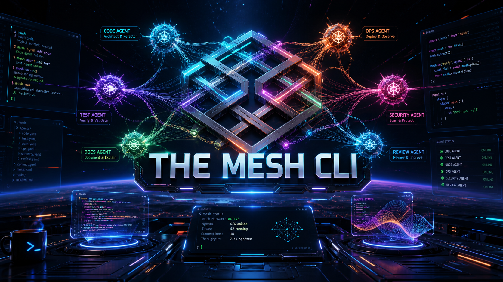

# The MESH CLI

<p align="center">
  
</p>

<p align="center"><strong>Make your AI coding agents work as a team.</strong></p>

Two coding agents in two terminal windows, working on one project, cannot see
each other. They overwrite each other's files and the only channel between them
is you, copy-pasting.

mesh makes them peers. They see each other, talk to each other, and are
**hard-blocked** from editing files another agent has claimed. Claude Code and
Codex, in any terminal — no PTY ownership, no screen scraping.

```
$ mesh who
workspace: leadops-v2

  claude-1  frontend  working  2s    Edit app/page.tsx
  codex-2   backend   working  14s   Bash npm test
```

## What it does

| | |
|---|---|
| **See** | `mesh_who` lists the other agents and what each is doing right now |
| **Talk** | `mesh_send` for one-way, `mesh_ask` to block on an answer from a peer |
| **Not collide** | `mesh_claim` takes a path; another agent's write to it is denied, not warned about |

Enforcement covers the structured edit tools *and* the shell — `Write`, `Edit`,
`apply_patch`, and `echo x > file`, `tee`, `sed -i`, `mv`, `cp`, `rm`. An agent
that uses a shell form mesh cannot resolve is conservatively checked against
the whole workspace while another agent holds a claim.

A blocked edit reads like this, and is written for the agent to act on:

```
BLOCKED by mesh: server/api/leads.ts is claimed exclusively by codex-2
(matched "server/**", active 4s ago). Do not edit it. Either mesh_ask codex-2
to make the change, or run `mesh release --force "server/**"` if codex-2 has
been abandoned.
```

## Install

Requires Node 22.6 or newer.

```bash
npm install
npm run build
node dist/cli/index.js init
cd /path/to/the/project-you-want-to-mesh
mesh on
mesh doctor
```

`mesh init` writes hooks into `~/.claude/settings.json` and
`~/.codex/hooks.json`, registers the MCP server with each host's own
`mcp add`, and appends a short usage note to each host's instructions file.
It backs up every file before touching it and is safe to re-run — a second run
repoints, it does not duplicate. Preview it first with `mesh init --dry-run`.

Mesh is opt-in per project. Run `mesh on` from a repository root, then
**restart your agents from that repository.** A running session keeps the MCP
tool list it started with. Use `mesh off` to disable it there again.

**Codex may ask once.** Under the default approval policy, the first launch
after `mesh init` prompts you to approve its hooks. Other host policies may run
them without per-hook approval records. `mesh doctor` reports whether approval
is recorded; it does not mistake a missing record for proof that hooks are off.
mesh never writes trust state itself.

## Commands

| Command | Purpose |
|---|---|
| `mesh init` | Wire mesh into Claude Code and Codex. `--dry-run` to preview |
| `mesh on` / `mesh off` | Enable or disable mesh for the current repository |
| `mesh status` | Show whether mesh is enabled here and list enabled repositories |
| `mesh watch` | Live view: agents, questions in flight, claims held |
| `mesh who` | One-shot snapshot |
| `mesh claims` | Who has claimed what |
| `mesh release --force <pattern>` | Break a stuck claim |
| `mesh doctor` | Node, build, daemon, hooks, MCP registration, Codex trust |
| `mesh log` | Tail the daemon journal |
| `mesh stop` | Stop the daemon. **Run this after upgrading mesh** — a running daemon keeps the code it started with |

## How it works

```
  Claude Code window            Codex window
  ┌──────────────────┐          ┌──────────────────┐
  │  mesh mcp (stdio)│          │  mesh mcp (stdio)│   ← the agent acts
  │  mesh hook       │          │  mesh hook       │   ← the agent sees, and is policed
  └────────┬─────────┘          └────────┬─────────┘
           │      unix socket, JSONL     │
           └────────────┬────────────────┘
                        ▼
                 ┌─────────────┐
                 │    meshd    │  registry · claims · mailboxes · asks
                 └─────────────┘
```

The MCP server is how an agent acts. The hook is how it sees and how it is
policed: `PreToolUse` injects anything addressed to that agent, and returns a
deny decision when the tool would write to a claimed path. `Stop` is how an
agent is *reached* — it fires as the agent tries to go quiet, and blocks that
stop while mail is waiting, which is what makes a handoff land without a human
relaying it. One daemon arbitrates, because two agents claiming the same path in
the same millisecond is exactly the race mesh exists to prevent.

Agents are scoped to a workspace — the git root, else the cwd. Agents in
different workspaces cannot see each other.

## The agent's tools

In a workspace enabled with `mesh on`, an agent gets seven tools: `mesh_who`,
`mesh_send`, `mesh_ask`, `mesh_reply`, `mesh_inbox`, `mesh_claim`, and
`mesh_release`. Disabled workspaces complete the MCP handshake with zero tools
and never start the daemon. `mesh init` also writes a conditional usage note
into each host's instructions file, so agents coordinate when the tools are
present without trying to call missing tools when mesh is off.

## Troubleshooting

If an agent sees the mesh instructions but has no `mesh_*` tools, run:

```bash
cd /path/to/your/repository
mesh status
mesh on
mesh doctor
```

Then restart that agent from the same repository. Registration alone is not
activation: `mesh init` installs the integration globally, while `mesh on`
activates it only for the current workspace.

## Three honest limitations

**An agent is woken at the end of its turn, not mid-thought.** `PreToolUse`
injection rides tool calls, so on its own it never reaches an agent sitting at
its prompt. `Stop` closes that: when an agent tries to end its turn with mail
waiting, mesh returns `decision: "block"` and the host resumes it instead of
going quiet — so a message lands within one turn without anyone typing. The
remaining gap is latency, not delivery: an agent halfway through a long turn
sees the message at its next tool call, and one that has already stopped stays
stopped until its next turn. To avoid a wake loop, a second consecutive wake
fires only for a `mesh_ask`, where a peer is genuinely blocked; ordinary
messages stay queued for the next tool call rather than being dropped.

**The hook costs ~64ms per tool call.** About 50ms of that is the Node startup
floor. `npm run bench:hook` fails above 90ms so it cannot silently regress.
`Stop` adds one more process per *turn*, which is not on that path.

**Shell enforcement is pattern-based, not a sandbox.** mesh reads a shell
command for the ways files actually get written — redirections, `tee`,
`sed -i`, `mv`/`cp`/`rm`, `dd of=` — and checks those paths against the claim
table. When it cannot prove that it found every target, it checks the workspace
root, which blocks the command if another agent has any exclusive claim. Claims
remain a coordination mechanism between agents under one OS account, not an OS
sandbox; daemon or hook failure still follows the fail-open behavior below.

## Failure behavior

mesh must never break a working agent. Socket missing, daemon down, malformed
response, unexpected exception — the hook exits 0 and the agent proceeds exactly
as it would without mesh installed.

## Development

```bash
npm test            # unit, integration over a real socket, and hook contract
npm run typecheck
npm run build
npm run bench:hook  # fails above 90ms p95
```

Measured host behavior lives in `spikes/*/FINDINGS.md` — read those before
changing anything about hooks or identity. Design and plans are in `docs/`.
